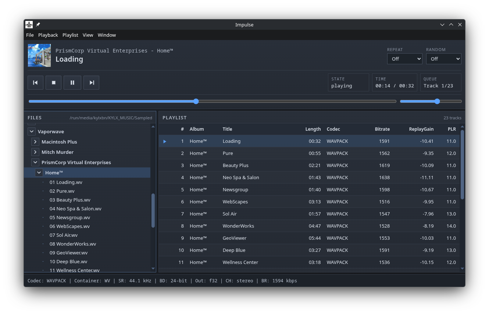
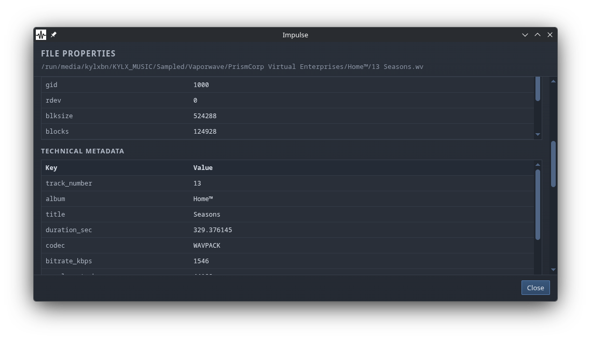

# Impulse

I just want a player that plays music and gives me what I need.

`mpd` with `ncmpcpp` is... well, not really comfortable since I use KDE Plasma and not a minimal WM.

I tried Strawberry but it's kinda... well, I mean it works fine and does its job well
but when playing files in the playlist that are in different sample rates, once the sample rate changes,
it kinda glitches out and stuff.

Ideally, I'd love to use Foobar2000 on Linux but I don't want to install Wine just to run Foobar2000
(yes, it's a me-problem).

So yeah. The fastest way to do this is Electron and MPV IPC.

Yeah, I don't like Electron either. But I have 64 GB RAM and an NVMe. I don't think Electron vs Qt
matters much (especially since I'm not really familiar with Qt 💀)

## Features

- Simple layout
- Rooted filesystem browser (directory-first, audio-only filtering). No library support.
- Playlist with sortable parity columns:
  - Track #
  - Album
  - Title
  - Length
  - Codec
  - Bitrate
  - ReplayGain
  - PLR (peak-to-loudness ratio)
- Playback controls: play/pause/stop, next/previous, seek, repeat, shuffle
- ReplayGain support with separate tagged/untagged preamp settings
- Live status from mpv
- `.lrc` timed lyrics panel with active-line sync
- Session autosave and restore
- Linux MPRIS bridge integration so media keys work on Wayland

## Screenshots

## Requirements

- Node.js (I have v24.13.0 installed but it probably works on newer versions... Maybe.)
- npm (only for building and dev. I use pnpm but it should work with npm anyway)
- `mpv` (required, it's basically a wrapper around mpv)
- `ffprobe` from ffmpeg (optional but recommended for richer metadata)

It should complain if a dependency is missing but I haven't tested that myself (too lazy to `pacman -Rsn ffmpeg mpv`)
